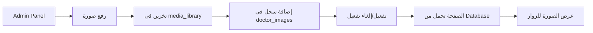

# 📸 نظام إدارة صور الدكتور

## 📋 نظرة عامة

نظام متكامل للتحكم في صور الدكتور في صفحات الموقع من خلال لوحة التحكم (Backend).

### ✨ المميزات الرئيسية

✅ **إدارة مركزية للصور** - التحكم الكامل في جميع صور الدكتور من لوحة واحدة  
✅ **أنواع صور متعددة** - دعم صفحات مختلفة (About، Contact، وغيرها)  
✅ **رفع سهل** - Drag & Drop مع معاينة مباشرة  
✅ **تفعيل ديناميكي** - صورة واحدة نشطة لكل نوع  
✅ **نصوص بديلة** - دعم اللغتين (عربي/إنجليزي)  
✅ **تكامل كامل** - الصفحات تحمل الصور تلقائياً من Database  

---

## 📂 هيكل النظام

### 1️⃣ **Database Schema**

```sql
-- جدول doctor_images
CREATE TABLE doctor_images (
  id INTEGER PRIMARY KEY AUTOINCREMENT,
  image_type TEXT NOT NULL,              -- 'about_hero', 'contact_profile', 'other'
  image_url TEXT NOT NULL,
  alt_text_ar TEXT,                      -- النص البديل بالعربية
  alt_text_en TEXT,                      -- النص البديل بالإنجليزية
  is_active INTEGER DEFAULT 1,           -- 0 = غير نشط, 1 = نشط
  display_order INTEGER DEFAULT 0,
  uploaded_by INTEGER DEFAULT 1,
  created_at DATETIME DEFAULT CURRENT_TIMESTAMP,
  updated_at DATETIME DEFAULT CURRENT_TIMESTAMP
);
```

**أنواع الصور المدعومة:**
- `about_hero` - الصورة الرئيسية في صفحة "عن الدكتور"
- `contact_profile` - الصورة الدائرية في صفحة "التواصل معنا"
- `other` - صور أخرى (للاستخدام المستقبلي)

---

## 🔌 API Endpoints

### Base URL
```
https://your-domain.com/api/admin
```

### 1️⃣ **GET /doctor-images**
عرض جميع الصور مع إمكانية الفلترة

**Query Parameters:**
- `type` (optional) - فلترة حسب نوع الصورة (`about_hero`, `contact_profile`, `other`)

**مثال:**
```bash
curl https://your-domain.com/api/admin/doctor-images?type=about_hero
```

**Response:**
```json
{
  "success": true,
  "images": [
    {
      "id": 1,
      "image_type": "about_hero",
      "image_url": "/static/uploads/doctor-about.jpg",
      "alt_text_ar": "د. محمد سعيد - استشاري جراحة القولون والمستقيم",
      "alt_text_en": "Dr. Mohammed Saeed - Consultant Colorectal Surgeon",
      "is_active": 1,
      "display_order": 1,
      "created_at": "2026-02-27 22:34:50",
      "updated_at": "2026-02-27 22:34:50"
    }
  ]
}
```

---

### 2️⃣ **GET /doctor-images/active/:type**
الحصول على الصورة النشطة حسب النوع

**Path Parameters:**
- `type` - نوع الصورة المطلوب

**مثال:**
```bash
curl https://your-domain.com/api/admin/doctor-images/active/contact_profile
```

**Response:**
```json
{
  "success": true,
  "image": {
    "id": 2,
    "image_type": "contact_profile",
    "image_url": "/static/uploads/doctor-profile.jpg",
    "alt_text_ar": "د. محمد سعيد ابن محسن علي",
    "alt_text_en": "Dr. Mohammed Saeed bin Mohsen Ali"
  }
}
```

---

### 3️⃣ **POST /doctor-images**
رفع صورة جديدة للدكتور

**Request Body:**
```json
{
  "image_type": "about_hero",
  "image_url": "/static/uploads/doctor-123.jpg",
  "alt_text_ar": "د. محمد سعيد - استشاري جراحة",
  "alt_text_en": "Dr. Mohammed Saeed - Consultant",
  "is_active": 1,
  "display_order": 1
}
```

**Response:**
```json
{
  "success": true,
  "message": "تم رفع صورة صفحة \"عن الدكتور\" بنجاح",
  "imageId": 5,
  "imageUrl": "/static/uploads/doctor-123.jpg"
}
```

**ملاحظة:** عند تفعيل صورة جديدة (`is_active: 1`)، سيتم إلغاء تفعيل الصور الأخرى من نفس النوع تلقائياً.

---

### 4️⃣ **PUT /doctor-images/:id**
تحديث بيانات صورة موجودة

**Path Parameters:**
- `id` - معرف الصورة

**Request Body:**
```json
{
  "alt_text_ar": "نص بديل جديد بالعربية",
  "alt_text_en": "New alt text in English",
  "is_active": 1,
  "display_order": 2
}
```

---

### 5️⃣ **PUT /doctor-images/:id/set-active**
تفعيل صورة معينة (وإلغاء تفعيل الأخرى من نفس النوع)

**مثال:**
```bash
curl -X PUT https://your-domain.com/api/admin/doctor-images/3/set-active
```

**Response:**
```json
{
  "success": true,
  "message": "تم تفعيل الصورة بنجاح"
}
```

---

### 6️⃣ **DELETE /doctor-images/:id**
حذف صورة

**مثال:**
```bash
curl -X DELETE https://your-domain.com/api/admin/doctor-images/5
```

**Response:**
```json
{
  "success": true,
  "message": "تم حذف الصورة بنجاح"
}
```

---

## 🖥️ واجهة المستخدم (Admin Panel)

### 📍 الرابط
```
https://your-domain.com/static/doctor-images-admin.html
```

### 🎨 المميزات

✨ **رفع الصور:**
- Drag & Drop مباشر
- معاينة فورية للصورة
- شريط تقدم الرفع
- التحقق من النوع والحجم (أقصى 5MB)

✨ **عرض الصور:**
- Grid متجاوب (3 أعمدة)
- Badge للصور النشطة
- فلترة حسب النوع (Tabs)
- معلومات كاملة لكل صورة

✨ **التحكم:**
- زر "تفعيل" للصور غير النشطة
- زر "حذف" لإزالة الصور
- Toast notifications للرسائل
- تحديث تلقائي بعد كل عملية

---

## 📄 تكامل الصفحات

### صفحة "عن الدكتور" (About Page)

**الملف:** `/src/routes/about-page.tsx`

```typescript
// تحميل الصورة النشطة من Database
const { results } = await DB.prepare(`
  SELECT image_url, alt_text_ar, alt_text_en
  FROM doctor_images
  WHERE image_type = 'about_hero' AND is_active = 1
  ORDER BY display_order ASC, created_at DESC
  LIMIT 1
`).all();

// استخدام الصورة في HTML

```

---

### صفحة "التواصل معنا" (Contact Page)

**الملف:** `/src/routes/contact-page.tsx`

```typescript
// تحميل الصورة النشطة من Database
const { results } = await DB.prepare(`
  SELECT image_url, alt_text_ar, alt_text_en
  FROM doctor_images
  WHERE image_type = 'contact_profile' AND is_active = 1
  ORDER BY display_order ASC, created_at DESC
  LIMIT 1
`).all();

// استخدام الصورة في HTML

```

---

## 🚀 دليل الاستخدام السريع

### 1️⃣ **رفع صورة جديدة**

1. اذهب إلى: `https://your-domain.com/static/doctor-images-admin.html`
2. اختر نوع الصورة (عن الدكتور / التواصل)
3. اسحب الصورة أو اضغط للاختيار
4. اكتب النص البديل (عربي وإنجليزي)
5. تأكد من تفعيل "تفعيل هذه الصورة تلقائياً"
6. اضغط "رفع الصورة"

**النتيجة:** سيتم رفع الصورة وتفعيلها، وستظهر تلقائياً في الصفحة المخصصة!

---

### 2️⃣ **تغيير صورة صفحة About**

1. افتح Admin Panel للصور
2. اذهب لتبويب "صفحة عن الدكتور"
3. ارفع الصورة الجديدة مع تفعيل "تفعيل تلقائياً"
4. الصورة القديمة ستُلغى تفعيلها تلقائياً
5. الصفحة `/about` ستعرض الصورة الجديدة فوراً!

---

### 3️⃣ **تغيير صورة صفحة Contact**

نفس الخطوات، لكن اختر نوع الصورة: "صفحة التواصل معنا"

---

## 📊 حالات الاستخدام

### ✅ حالة 1: رفع أول صورة
- يتم رفع الصورة وتفعيلها
- تظهر فوراً في الصفحة المحددة

### ✅ حالة 2: رفع صورة بديلة
- يتم رفع الصورة الجديدة
- إذا تم تفعيلها: الصورة القديمة تُلغى تلقائياً
- الصفحة تعرض الصورة الجديدة فوراً

### ✅ حالة 3: عدة صور لنفس النوع
- يمكن رفع أكثر من صورة
- صورة واحدة فقط تكون نشطة
- يمكن التبديل بينها بضغطة واحدة

### ✅ حالة 4: حذف صورة نشطة
- يتم حذف الصورة
- الصفحة تعرض fallback image افتراضية

---

## 🔄 سير العمل الكامل



---

## 🛠️ التطوير المستقبلي

### 🔜 مميزات مخطط إضافتها:

1. **معالجة الصور:**
   - اقتصاص تلقائي
   - تغيير الحجم
   - ضغط الصور
   - Filters جاهزة

2. **Cloudflare R2:**
   - رفع الصور مباشرة إلى R2 (production)
   - CDN سريع للصور
   - مساحة تخزين غير محدودة

3. **معرض صور:**
   - صفحة Gallery للدكتور
   - Slideshow تلقائي
   - Lightbox للعرض الكامل

4. **تقارير:**
   - أكثر الصور استخداماً
   - مساحة التخزين المستخدمة
   - إحصائيات الرفع

---

## 📞 الدعم

للمساعدة أو الاستفسارات:
- 📧 Email: admin@drmohammedsaeed.com
- 💬 WhatsApp: +966 56 992 5966

---

## 📅 تاريخ الإنشاء

**التاريخ:** 27 فبراير 2026  
**الإصدار:** 1.0.0  
**الحالة:** ✅ جاهز للاستخدام الفوري

---

**🎉 نظام إدارة صور الدكتور جاهز الآن!**
